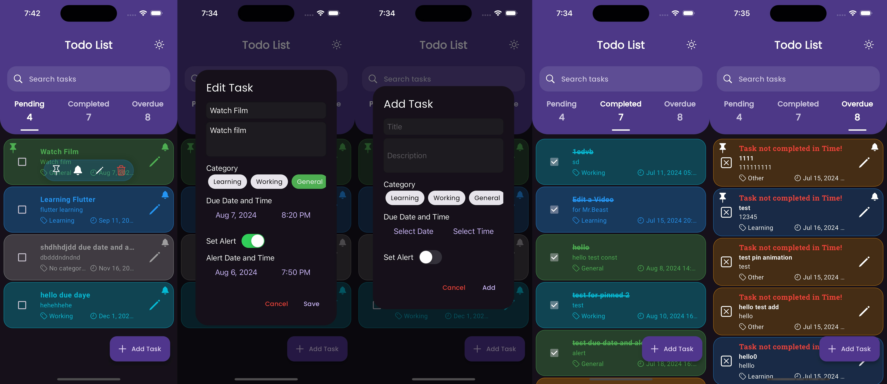

# Todo List App

A feature-rich and visually appealing Todo List application built with Flutter.

## Features

- Create, edit, and delete tasks
- Mark tasks as complete
- Set due dates for tasks
- Categorize tasks
- Pin important tasks
- Search functionality
- Dark and light theme support
- Overdue task highlighting
- Task reactions
- Local notifications for task reminders

## Screenshots

## Getting Started

### Prerequisites

- Flutter SDK
- Dart SDK
- Android Studio / VS Code

### Installation

1. Clone the repository: `git clone https://github.com/dcaayushd/CODSOFT_TODOList_App.git`
2. Navigate to the project directory: `cd todo-list-app`
3. Install dependencies: `flutter pub get`
4. Run the app: `flutter run`

## Usage

- Add a new task by tapping the "+" button
- Long-press a task to access quick actions (pin, set alert, edit and delete task.)
- Swipe a task to delete it
- Tap on a task to edit its details
- Use the search bar to find specific tasks
- Toggle between dark and light themes using the theme switch

## Dependencies

- flutter
- flutter_local_notifications
- flutter_slidable:
- google_fonts
- intl
- provider
- shared_preferences
- timezone
- uuid

## Contributing

Contributions are welcome! Please feel free to submit a Pull Request.

1. Fork the project
2. Create your feature branch (`git checkout -b feature/AmazingFeature`)
3. Commit your changes (`git commit -m 'Add some AmazingFeature'`)
4. Push to the branch (`git push origin feature/AmazingFeature`)
5. Open a Pull Request

## License

This project is licensed under the MIT License. [See the LICENSE file for more details.](LICENSE)

## Contact

dcaayushd - [@dcaayushd](https://twitter.com/dcaayushd)
